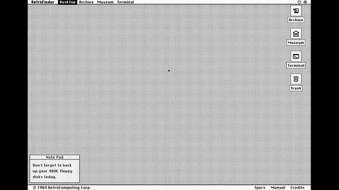

# RetroFinder



A retro-styled interactive desktop that simulates the look and feel of a 1984 Macintosh System 1. What started as a simple static page to share the history of retrocomputing with a friend ended up becoming a fully interactive browser desktop — complete with draggable windows, a boot screen, a working terminal, and period-accurate aesthetics.

---

## Features

- **Boot screen** — animated loading sequence on first visit (skipped on return via `sessionStorage`)
- **Draggable windows** — canvas outline while dragging, snaps on release
- **Zoom-rect animation** — windows zoom open from their desktop icon and collapse back when closed
- **Minimize / Restore** — windows collapse to a title-bar strip at the bottom of the screen
- **Retro cursor** — custom SVG arrow + hourglass wait state
- **Archive** — scrollable table of historical computers with a detail panel on selection
- **Museum** — card carousel with image, specs, and search by name
- **Terminal** — keyboard-driven CLI (commands: `HELP`, `DIR`, `CLS`, `VER`, `DATE`, `HISTORY`, `LIST`, `EXIT`)
- **Specs, Manual, Credits** — additional info windows accessible from the footer

---

## Tech Stack

| Layer | Technology |
|---|---|
| Framework | [Astro 6](https://astro.build) — static-site generation, zero JS by default |
| Styling | [Tailwind CSS 4](https://tailwindcss.com) — utility-first, configured via `@theme` tokens |
| Scripting | Vanilla JavaScript — no client-side framework |
| Typography | Chicago FLF (local TTF) + Google Material Symbols |
| Build tool | Vite (bundled with Astro) |
| Runtime | Node.js ≥ 22 |

---

## Project Structure

```
retrofinder/
├── public/
│   ├── fonts/          # Chicago.ttf
│   ├── icons/          # macintosh.svg and other UI icons
│   └── images/         # Computer photos (.webp, one per machine id)
├── src/
│   ├── data/
│   │   └── computer.ts         # Computer interface + dataset (10 machines)
│   ├── layouts/
│   │   └── RetroLayout.astro   # HTML shell: nav, footer, boot screen, cursor, canvas
│   ├── components/
│   │   ├── Window.astro        # Reusable window chrome (title bar, close/minimize)
│   │   └── windows/
│   │       ├── ArchiveWindow.astro
│   │       ├── MuseumWindow.astro
│   │       ├── TerminalWindow.astro
│   │       ├── SpecsWindow.astro
│   │       ├── ManualWindow.astro
│   │       └── CreditsWindow.astro
│   ├── scripts/
│   │   ├── windows.ts          # createWindowManager: open, close, minimize, restore, z-index
│   │   ├── drag.ts             # makeDraggable — title-bar drag with canvas outline
│   │   ├── zoom.ts             # initCanvas + zoomRect animation
│   │   ├── nav.ts              # setActiveNav — highlights active item in nav bar
│   │   ├── archive.ts          # initArchive — table rows → detail panel
│   │   ├── museum.ts           # initMuseum — card carousel, prev/next, search
│   │   └── terminal.ts         # commands dict + initTerminal — keyboard CLI
│   ├── pages/
│   │   └── index.astro         # Single page — wires everything together
│   └── styles/
│       └── global.css          # Tailwind @theme tokens + retro utility classes
└── package.json
```

---

## Getting Started

```bash
# Install dependencies
npm install

# Start dev server (http://localhost:4321)
npm run dev

# Build for production
npm run build

# Preview the production build locally
npm run preview
```

---

## Data

All computer entries live in `src/data/computer.ts`. Each entry follows the `Computer` interface:

```ts
interface Computer {
  id: string;           // used as image filename: /images/{id}.webp
  name: string;
  year: number;
  type: "Mainframe" | "Micro" | "Personal" | "GUI Station" | "Revolution" | "Workstation";
  manufacturer: string;
  cpu: string;
  cpuSpeed: string;
  ram: string;
  os: string;
  price: string;
  description: string;
  significance: string;
}
```

To add a new machine, append an entry to the `computers` array and drop a matching `.webp` image in `public/images/`.

---

## Adding a New Window

1. Create `src/components/windows/YourWindow.astro` using `<Window>` as the shell.
2. Add a wrapper `<div id="window-your-wrapper" ...>` in `src/pages/index.astro`.
3. Register it in `windows.ts` — add to `defaultPositions` and `minimizedSlots`.
4. Optionally add a desktop icon in `index.astro` with `data-window="your"`.

---

## License

MIT
